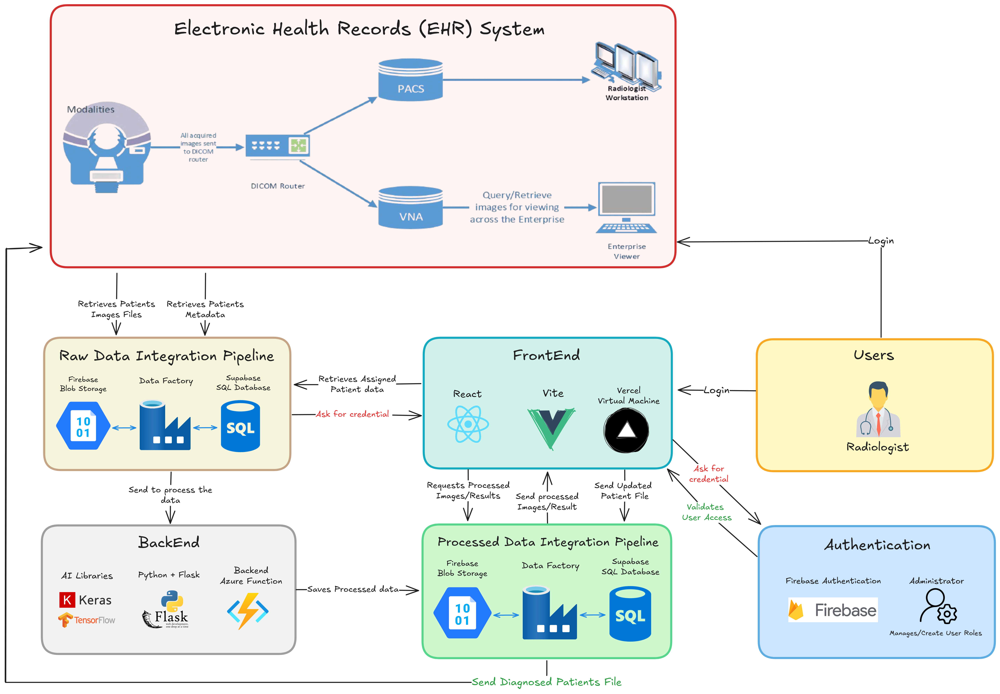

# SwiftScanAI

A comprehensive bilingual (Arabic/English) radiology diagnostic platform that combines artificial intelligence with medical imaging analysis for neurological conditions. The system assists radiologists in diagnosing brain scans through AI-powered analysis while maintaining a fully bilingual interface.

## Core Features

### AI Integration
- 🧠 Advanced AI analysis of brain MRI scans
- 📊 Confidence scoring for AI-generated diagnoses
- 📝 AI-generated medical history narratives
- 🔄 Automated priority ranking system

### Clinical Workflow
- 🏥 Comprehensive case management system
- 📋 Multi-stage diagnosis workflow (Initial → Final)
- 🔍 Detailed patient information tracking
- 📊 Clinical notes and feedback system

### User Experience
- 🌐 Full bilingual support (Arabic/English)
- 🌓 Light/Dark mode theming
- 📱 Responsive design for all devices
- 📊 Interactive data visualization
- 🔍 Advanced search and filtering capabilities

### Security & Performance
- 🔒 Secure authentication system
- ⚡ Real-time updates
- 📈 Performance optimization
- 🔐 Role-based access control

## System Architecture



## Technical Architecture

### Frontend
- **Framework**: React 18 with TypeScript
- **Build Tool**: Vite
- **UI Components**: 
  - Radix UI for accessible components
  - Tailwind CSS for styling
  - Recharts for data visualization
- **State Management**: React Query
- **Form Handling**: React Hook Form
- **Routing**: React Router DOM
- **Internationalization**: Custom i18n implementation

### Backend
- **Database**: PostgreSQL (via Supabase)
- **Authentication**: Supabase Auth
- **File Storage**: Supabase Storage
- **API**: Supabase Edge Functions

### AI Integration
- Advanced brain scan analysis
- Natural language processing for medical history
- Priority ranking algorithm
- Confidence score calculation

## Prerequisites

Before you begin, ensure you have installed:
- Node.js (v16.0.0 or higher)
- Bun (Latest version) or npm
- Git

## Installation

1. Clone the repository:
```bash
git clone [repository-url]
cd swiftscan-ai
```

2. Install dependencies:
Using bun:
```bash
bun install
```
Or using npm:
```bash
npm install
```

3. Configure environment variables:
Create a `.env` file in the root directory:
```env
VITE_SUPABASE_URL=your_supabase_project_url
VITE_SUPABASE_ANON_KEY=your_supabase_anon_key
```

## Development

Start the development server:
```bash
bun dev
```
Access the application at `http://localhost:5173`

## Project Structure

```
swiftscan-ai/
├── src/
│   ├── components/     # UI components & layouts
│   │   ├── auth/      # Authentication components
│   │   ├── charts/    # Data visualization
│   │   ├── layout/    # Layout components
│   │   └── ui/        # Reusable UI components
│   ├── contexts/      # React contexts
│   ├── hooks/         # Custom React hooks
│   ├── integrations/  # Third-party integrations
│   ├── lib/           # Utility functions
│   ├── locales/       # Translation files
│   └── pages/         # Application routes
```

## Key Features Documentation

### Case Management
- Priority-based case queuing
- AI-assisted diagnosis workflow
- Real-time case status tracking
- Comprehensive patient history

### AI Analysis
- Brain scan analysis with confidence scoring
- Automated priority ranking
- Natural language medical history generation
- Decision support system

### Bilingual Support
- Full Arabic/English interface
- RTL/LTR layout management
- Localized date formatting
- Bilingual medical terminology

### Data Visualization
- Interactive dashboards
- Priority distribution charts
- Case status analytics
- AI confidence tracking

## Contributing

1. Fork the repository
2. Create your feature branch (`git checkout -b feature/YourFeature`)
3. Commit your changes (`git commit -m 'Add YourFeature'`)
4. Push to the branch (`git push origin feature/YourFeature`)
5. Open a Pull Request

## License

This project is licensed under the MIT License - see the LICENSE file for details.

## Support

For technical support, please contact: bsulimanalgomlas@stu.kau.edu.sa
